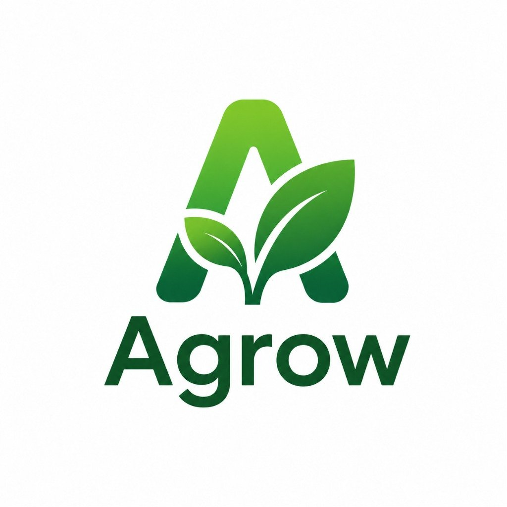
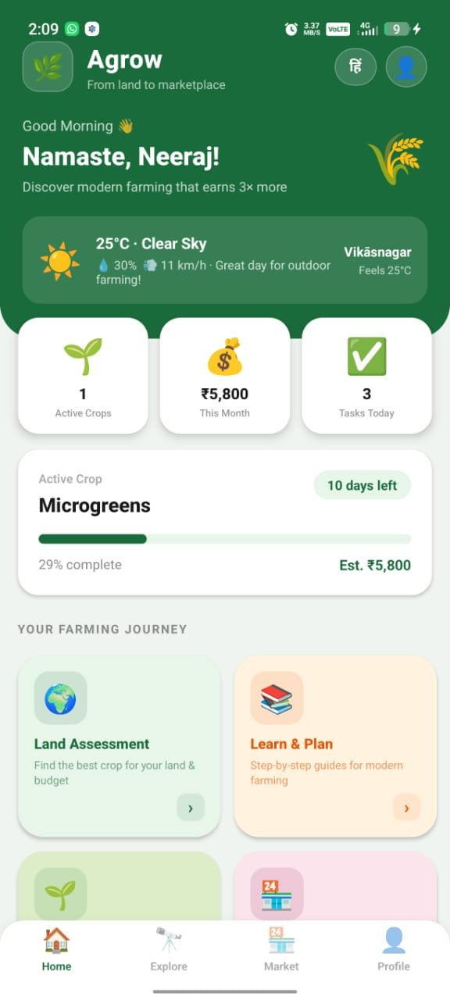
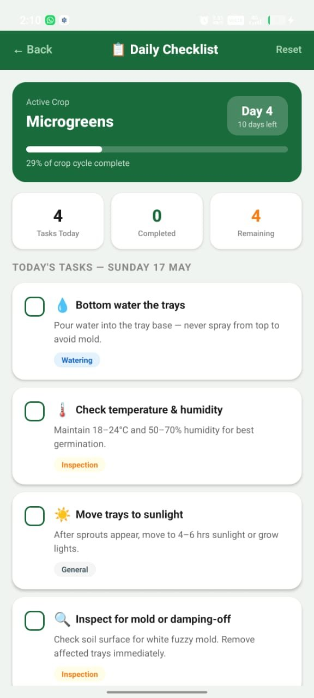
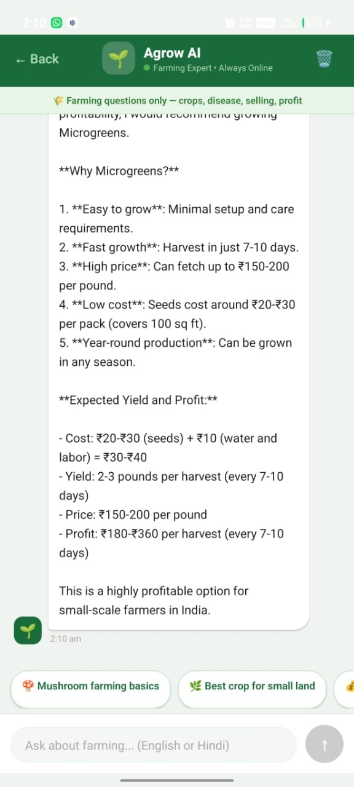
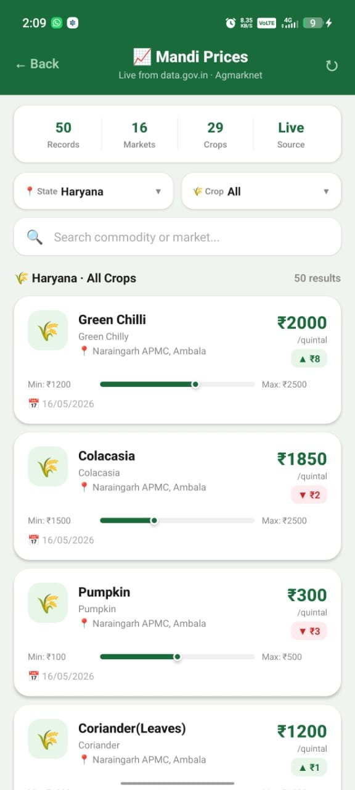
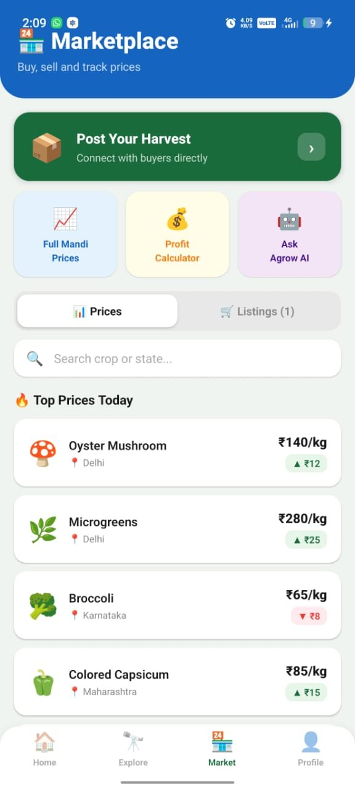
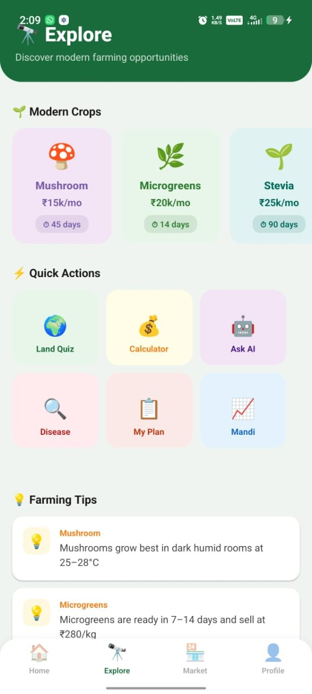
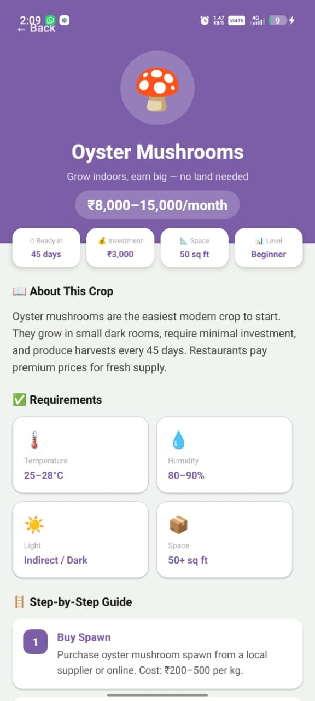
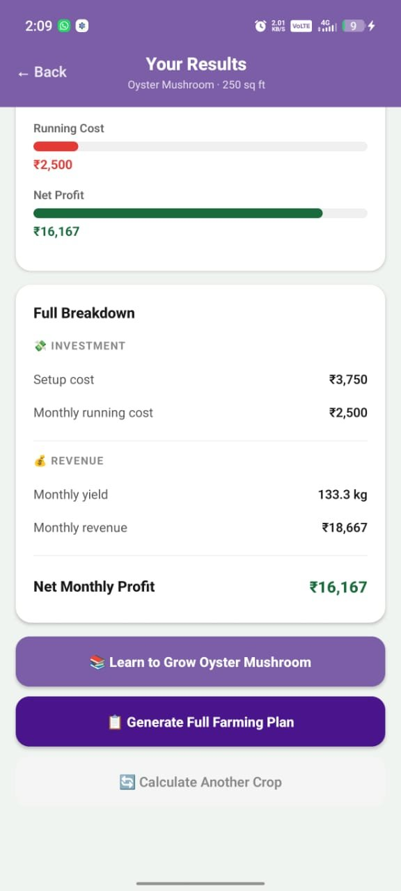

<div align="center">



# 🌱 Agrow
### From Empty Land to Marketplace

**India's smartest agricultural platform — guiding farmers from crop selection to selling.**

[](https://reactnative.dev/)
[](https://www.typescriptlang.org/)
[](https://supabase.com/)
[](https://expo.dev/)
[](https://agrow-rosy.vercel.app)
[](LICENSE)

</div>

---

## 📱 Screenshots

<div align="center">

| Home | Daily Checklist | Agrow AI | Mandi Prices |
|:----:|:---------------:|:--------:|:------------:|
|  |  |  |  |

| Marketplace | Explore | Crop Guide | Profit Calculator |
|:-----------:|:-------:|:----------:|:-----------------:|
|  |  |  |  |

</div>

---

## 🌾 The Problem

India has **140 million farming households**. Most earn ₹5,000–8,000/month growing the same crops their parents grew — wheat, rice, basic vegetables.

Meanwhile, modern crops like microgreens, oyster mushrooms, and hydroponics can earn **3–5× more** in the same space. But farmers have:

- ❌ No awareness of modern alternatives
- ❌ No step-by-step growing guidance
- ❌ No access to live market prices
- ❌ No way to connect with buyers directly

**Agrow solves all of this. For free.**

---

## ✨ Features

### 🤖 AI Farming Assistant
Powered by **Groq Llama 3.1** — answers any farming question in English or Hindi. Strictly farming-focused for accurate, relevant answers.

### 📈 Live Mandi Prices
Real-time crop prices from **3,000+ Indian mandis** via the official Agmarknet API (data.gov.in). Filter by state, crop, and market.

### 🔍 Plant Disease Detector
Photograph a sick plant → get instant AI diagnosis using **Llama 4 Scout Vision** — disease name, severity, treatment steps, and prevention tips.

### 🏪 Direct Marketplace
Farmers post harvest listings. Buyers browse and call directly. **Zero middlemen.** Secured with Supabase Row Level Security — only owners can edit their listings.

### ✅ Daily Growing Checklist
Auto-generated daily farming tasks based on the active crop and day number in the growing cycle. Never miss a watering or inspection.

### 💰 Profit Calculator
Enter your land size → select a crop → get a full financial breakdown: setup cost, running cost, yield, revenue, and **net monthly profit**.

### 🌐 Fully Bilingual
Complete **English + हिंदी** support across all screens using i18next. Designed for farmers across India regardless of literacy level.

### ☀️ Weather Integration
Live hyperlocal weather via OpenWeatherMap — temperature, humidity, wind, and farming recommendations based on current conditions.

---

## 🌿 Supported Modern Crops

| Crop | Monthly Profit | Ready In | Difficulty |
|------|---------------|----------|------------|
| 🍄 Oyster Mushrooms | ₹8,000–15,000 | 45 days | Beginner |
| 🌿 Microgreens | ₹10,000–20,000 | 7–14 days | Beginner |
| 🌱 Stevia | ₹15,000–25,000 | 3 months | Intermediate |
| 🥦 Exotic Vegetables | ₹20,000–40,000 | 60–90 days | Intermediate |
| 🌾 Lemongrass | ₹12,000–20,000 | 3 months | Beginner |
| 💧 Hydroponics | ₹30,000–80,000 | 60 days | Advanced |

---

## 🛠️ Tech Stack

| Layer | Technology |
|-------|-----------|
| **Framework** | React Native + Expo (Expo Router) |
| **Language** | TypeScript |
| **Database** | Supabase PostgreSQL + Row Level Security |
| **AI Assistant** | Groq Llama 3.1 8B |
| **Disease Detection** | Llama 4 Scout Vision |
| **Market Data** | Agmarknet API (data.gov.in) |
| **Weather** | OpenWeatherMap API |
| **i18n** | i18next (English + Hindi) |
| **Build** | EAS Build |
| **DB Architecture** | Horizontal partitioning across regional nodes |

### 🗄️ Distributed Database Architecture

```
┌─────────────────┐    ┌─────────────────┐    ┌─────────────────┐
│  North India 🏔️  │    │  West India 🌊   │    │  South India 🌴  │
│  marketplace_   │    │  marketplace_   │    │  marketplace_   │
│  north          │    │  west           │    │  south          │
│  HR·PB·UP·DL·UK │    │  MH·GJ·RJ·GA   │    │  KA·KL·TN·AP   │
└────────┬────────┘    └────────┬────────┘    └────────┬────────┘
         │                     │                       │
         └─────────────────────┼───────────────────────┘
                               │
                    ┌──────────▼──────────┐
                    │  Replication Log 🔄  │
                    │  node_source →      │
                    │  coordinator        │
                    └─────────────────────┘
```

---

## 🚀 Getting Started

### Prerequisites
- Node.js 18+
- Expo CLI
- Supabase account
- Groq API key

### Installation

```bash
# Clone the repository
git clone https://github.com/neerajchoudhary/agrow.git
cd agrow

# Install dependencies
npm install

# Set up environment variables
cp .env.example .env
```

### Environment Variables

```env
EXPO_PUBLIC_SUPABASE_URL=your_supabase_url
EXPO_PUBLIC_SUPABASE_ANON_KEY=your_supabase_anon_key
EXPO_PUBLIC_GROQ_API_KEY=your_groq_api_key
EXPO_PUBLIC_OPENWEATHER_API_KEY=your_openweather_api_key
EXPO_PUBLIC_GOV_API_KEY=your_data_gov_in_api_key
```

### Run the App

```bash
# Start development server
npx expo start

# Run on Android
npx expo run:android

# Run on iOS
npx expo run:ios
```

---

## 📁 Project Structure

```
agrow/
├── app/                    # Expo Router screens
│   ├── (tabs)/
│   │   ├── index.tsx      # Home screen
│   │   ├── explore.tsx    # Explore crops
│   │   └── market.tsx     # Marketplace
│   ├── crop/              # Crop detail screens
│   ├── ai/                # Agrow AI chat
│   ├── disease/           # Disease detector
│   └── checklist/         # Daily checklist
├── components/            # Reusable UI components
├── lib/                   # Supabase client, API helpers
├── locales/               # i18n translations
│   ├── en.json
│   └── hi.json
├── assets/                # Images used in README
└── constants/             # Crop data, colors, config
```

---

## 🌍 Market Opportunity

- **₹20 Lakh Crore** — India's agricultural GDP
- **600M+** smartphone users among Indian farmers
- **25% CAGR** — India's agri-tech market growth rate
- **₹25 Lakh** — max grant available via PM Kisan / NABARD / Startup India

---

## 👨‍💻 Team

Built by Computer Science students, Batch 2024–25:

| Name | Role | Roll No |
|------|------|---------|
| **Neeraj Choudhary** | Project Lead & Full Stack Developer | 0241BTCS064 |
| **Satyam Kumar Rath** | Database Designer & Backend | 0241BTMB016 |
| **Harsh Khandelwal** | NoSQL & API Integration | 0241BTCS026 |

---

## 🤝 Contributing

Contributions are welcome!

1. Fork the repository
2. Create your feature branch (`git checkout -b feature/AmazingFeature`)
3. Commit your changes (`git commit -m 'Add some AmazingFeature'`)
4. Push to the branch (`git push origin feature/AmazingFeature`)
5. Open a Pull Request

---

## 📄 License

This project is licensed under the MIT License — see the [LICENSE](LICENSE) file for details.

---

## 📬 Contact

**Neeraj Choudhary** — neeraj89303@gmail.com

🌐 Live Website: [agrow-app.vercel.app](https://agrow-app.vercel.app)

---

<div align="center">

Built with 💚 for **140 million Indian farmers**

⭐ **Star this repo if you find it useful!**

</div>
